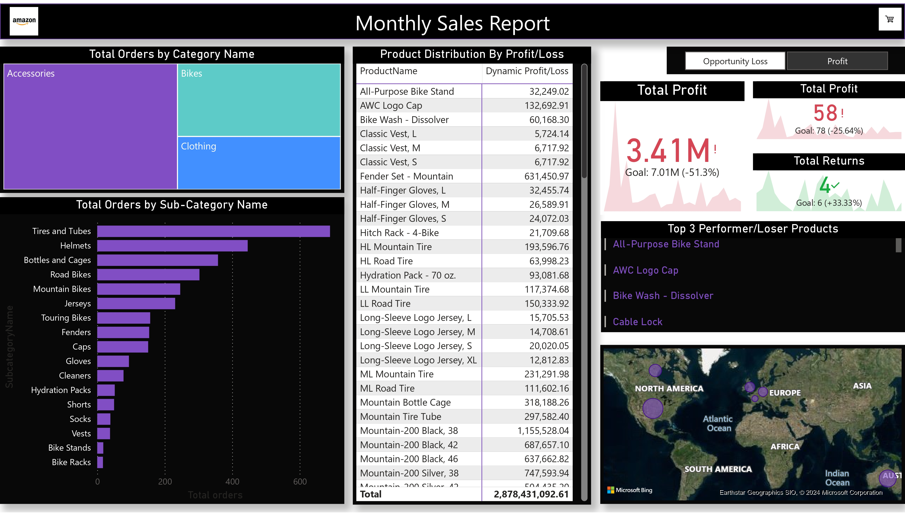

# Amazon Monthly Sales Report (2015-2017)



## Overview
This repository contains a comprehensive Power BI report analyzing Amazon's monthly sales data from 2015 to 2017. The report provides valuable insights into sales trends, seasonal patterns, and key performance metrics across different categories and regions over the three-year period. By leveraging interactive visualizations and dynamic filters, users can explore sales data in detail, identify key drivers of growth, and uncover hidden patterns in Amazon's sales performance. This report is a useful tool for data analysts, business strategists, and anyone interested in understanding e-commerce sales dynamics.

## Report Access
You can view the interactive Power BI report by clicking the link below:

[Amazon Monthly Sales Report (2015-2017)](https://app.powerbi.com/groups/me/reports/36734ddc-fe39-49fa-98d0-60d0df548a0a?pbi_source=desktop)

Alternatively, scan the QR code below to view the report on your mobile device:


## Features
- **Sales Trends:** Explore how sales have evolved month over month and year over year.
- **Seasonal Analysis:** Identify peak sales periods and understand seasonal impacts on sales.
- **Performance Metrics:** Key performance indicators (KPIs) like total sales, average order value, and growth rates are highlighted.

## How to Use
1. **View Online**: Use the link or QR code above to access the interactive report.
2. **Clone Repository**: If you want to explore the Power BI file locally, clone this repository and open the `.pbix` file in Power BI Desktop.

## Prerequisites
- **Power BI Desktop**: You will need Power BI Desktop to view and edit the `.pbix` file. You can download it from [here](https://powerbi.microsoft.com/desktop/).

## Getting Started
To get started with this report locally:
1. Clone the repository:
   ```bash
   git clone https://github.com/YOUR_USERNAME/Amazon-Sales-Report-2015-2017.git
